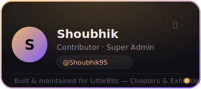

# LittleBits — Chapters & Exhibitions Hub

A clean, interactive, and premium portal built for college students to discover campus clubs, RSVP to upcoming workshops, track events, manage activity passes, and access administrative consoles.

**Live Demo:** https://littlebitsclub.netlify.app/

This project is built using vanilla **HTML5**, **CSS3**, and **ES6 JavaScript**, with a focus on rich frosted-glass aesthetics, micro-interactions, responsive grids, and a lightweight feel — no frameworks, no build step.

---

##  Core Features & Resolved Fixes


### 1. Unified Architecture & Clean File Splitting
To keep files concise and maintainable, key modules are split into a clean two-part structure:

- **Mock Database**
  - `js/db.js` — Stores static arrays (`SIMULATED_USERS`, `DEFAULT_CLUBS`, `DEFAULT_EVENTS`) and self-healing reset logic.
  - `js/db2.js` — Contains database helper functions (`getClubs`, `joinClub`, `registerForEvent`, etc.).
- **Dynamic Navigation Bar**
  - `js/navbar.js` — Handles HTML template strings and responsive navbar layout markup.
  - `js/navbar2.js` — Manages form validation, simulated directory switching, and authentication modals.
- **Authority Control Panel**
  - `js/admin.js` — Configures Super Admin vs. Club Admin scopes, metric widgets, and event configuration triggers.
  - `js/admin2.js` — Renders dynamic tabs (Dashboard, Events, Members, Settings, Verify), handles verification scanning, and manages attendance roster sheets.

### 2. Sign-Up Data Persistence
- **Issue**: Registering custom clubs or signing up new accounts triggered a database self-healing check on reload, which reset `localStorage` and deleted newly created accounts.
- **Resolution**: Self-healing checks in `db.js` now only trigger if the mandatory demo accounts (`shoubhik@campus.edu`, `aman@campus.edu`, or `doei@campus.edu`) are entirely missing. Custom clubs and signed-up accounts now persist permanently.

### 3. Quick Demo Logins
- **Integration**: Added **Quick Demo Login** buttons inside the Authenticator Modal (Login tab) and the Unauthorized Access Warning Modal.
- **Click-to-Log**: Lets testers instantly log in as **Shoubhik** (Super Admin), **Aman** (Club Admin), or **Doei** (Student) with a single click, automatically redirecting them to their respective panels.

### 4. Admin Portal Tab Switcher & Event Deployment
- **Issue**: Clicking tabs in the Admin Console rendered blank tables because the active tab state was trapped inside local IIFE closures.
- **Resolution**: Exposed `window.adminActiveTab` globally. Tab click listeners now update this global state, restoring instantaneous rendering across the Dashboard, Events, and Members tabs.
- **Pre-selected Club**: When a Club Admin opens the "Configure Event" modal, their assigned club is automatically pre-selected in the dropdown. If their club is missing or deleted, the modal gracefully falls back to showing all available clubs.

### 5. Guest Interception & Warning on Dashboard
- **Dashboard Guard**: Added a click navigation guard on the "Dashboard" tab in the navbar.
- **Resolution**: Guests attempting to access the Student Dashboard are intercepted and shown a clear warning modal — **"Access Denied: Authentication Required"** — explaining that they must log in or sign up to access the Student Dashboard.

### 6. Selective Loading Screen Display (Bypass Loader)
- **Smooth Navigation**: Added a `skipIntroNext` `sessionStorage` flag.
- **Resolution**: Reloading the page on action-based refreshes (Login, Signup, simulated profile switches, Logout, or clearing the inbox) bypasses the 3-second loader screen and shows content immediately. The loader remains active for first-time session loads or manual browser-level refreshes.

### 7. Toast Notification Stacking System
- **Refined Notifications**: Built a vertical stacking notification container (`#toast-container`) in the bottom-right corner.
- **UI/UX**: Toasts slide in smoothly from the right, stack neatly, and dismiss automatically after 4 seconds — or manually via the close (`✕`) button.

### 8. Premium Glassmorphism Aesthetics
- **Frosted Cards**: Replaced thin borders and high-transparency surfaces with premium frosted-glass backgrounds (`rgba(18, 18, 24, 0.72)`), a `16px` backdrop-filter blur, and smooth elevation offsets on hover.
- **Outline Logo Inversion**: Automatically detects and inverts dark outline logos for Coding, Music, and Photography categories, displaying them in bright white for optimal contrast.

### 9. Interactive Background Emoji Layering
- **Layering**: Floating emojis stay strictly in the background (`z-index: 1`), behind all content cards.
- **Pointer Events**: Gaps between cards allow pointer hovers to pass through to the background. Hovering over a floating emoji lifts the parent layer and node (`z-index: 9999`) so the club name tooltip displays clearly above other elements.

---

##  Tech Stack

| Layer | Details |
|---|---|
| **Core Structure** | HTML5 (semantic tags, templates) |
| **Styling** | CSS3 (vanilla variable tokens, flexbox, grids, frosted-glass filters, keyframe animations) |
| **Icons** | Lucide Icons (dynamic inline SVG rendering via CDN script) |
| **Database** | LocalStorage mock database API |
| **Avatars** | Dicebear Pixel Art SVG API |

---

##  Running the Project Locally

This is a lightweight static site — no package managers or bundlers required.

1. **Clone the repository**
   ```bash
   git clone https://github.com/amanrock1/LittleBits.git
   cd LittleBits
   ```

2. **Run a local server**
   - Open `index.html` directly in any web browser, **or**
   - Use **Live Server** in VS Code, **or**
   - Use Python's built-in HTTP server:
     ```bash
     python -m http.server 8000
     ```
     Then open [http://localhost:8000](http://localhost:8000) in your browser.

---

##  Demo Accounts Reference

| Name | Email | Role | Permissions |
|---|---|---|---|
| **Shoubhik** | `shoubhik@campus.edu` | Super Admin | Access to the Authority Panel; can manage all clubs, verify all passes, and remove members |
| **Aman** | `aman@campus.edu` | Club Admin | Admin of Apex Coders; can manage Apex Coders events, verify event rosters, and edit event details |
| **Doei** | `doei@campus.edu` | Student | Undergraduate student; can RSVP to events, claim certificates, and view badges |

---

##  Project Structure

```
LittleBits/
├── index.html
├── js/
│   ├── db.js          # Static data + self-healing reset logic
│   ├── db2.js          # Database helper functions
│   ├── navbar.js       # Navbar markup/templates
│   ├── navbar2.js      # Auth modals + form validation
│   ├── admin.js        # Admin scopes + metric widgets
│   └── admin2.js       # Admin tabs, verification, rosters
└── ...
```

---

---

## 👨‍💻 Authors & Contributors

<div align="center">



<br><br>


</div>

<br>

<div align="center">

### 🛠 Project Team

| Role | Name | GitHub | LinkedIn |
|------|------|--------|----------|
| Author & Maintainer | Aman Prabhat | [@amanrock1](https://github.com/amanrock1) | [LinkedIn](https://www.linkedin.com/in/aman-prabhat-b75735325/) |
| Contributor & Super Admin Systems | Shoubhik Bhattacharya | [@Shoubhik95](https://github.com/Shoubhik95) | [LinkedIn](https://www.linkedin.com/in/shoubhik-bhattacharya-8b4099324/) |

</div>

---

## 📂 Project Structure

```text
LittleBits/
│
├── Author.svg
├── Contributorshoubhik.svg
├── README.md
│
├── css/
│   └── style.css
│
├── js/
│   ├── db.js
│   ├── db2.js
│   ├── navbar.js
│   ├── navbar2.js
│   ├── admin.js
│   └── admin2.js
│
├── public/
│
├── index.html
├── clubs.html
├── club-details.html
├── events.html
├── event-details.html
├── dashboard.html
├── admin.html
│
└── .gitignore
```

---

## 🌟 Highlights

- Premium Glassmorphism UI
- Dynamic Club Management
- RSVP Event Registration
- Activity Pass Verification
- Student Dashboard
- Authority Control Panel
- Quick Demo Accounts
- Toast Notification System
- LocalStorage Persistence
- Responsive Design
- Pure HTML, CSS & JavaScript
- No Framework Dependencies

---

## 🚀 Future Enhancements

- Backend Integration
- Real Authentication
- Cloud Database Support
- QR-Based Event Entry
- Club Analytics Dashboard
- Certificate Generation
- Progressive Web App Support
- Dark / Light Theme Switching

---

## 📜 License

This project is intended for educational, portfolio, and learning purposes.

© 2026 LittleBits — Chapters & Exhibitions Hub

Built with ❤️ by Aman Prabhat and contributions from Shoubhik Bhattacharya.
